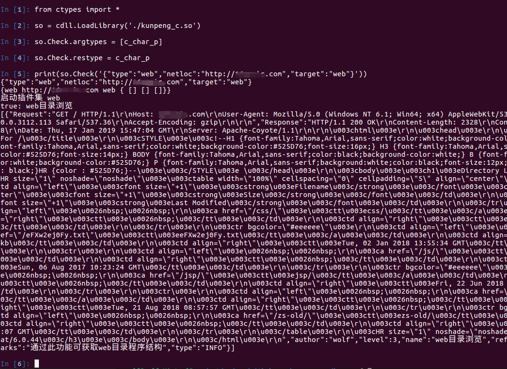

# Kunpeng

kunpeng是一个Golang编写的开源POC检测框架，以动态链接库的形式提供各种语言调用，通过此项目可快速对目标进行安全漏洞检测，比攻击者快一步发现风险漏洞。


## 简介

作为漏洞发现、检测中的核心：漏洞库，存在着维护成本高，无法及时更新、不同框架以及各自独立维护的问题，Kunpeng将以动态链接库的形式提供调用，安全开发人员只需专注于相关安全检测系统的业务逻辑代码实现，而不必各自重复的耗费精力维护漏洞库。

Kunpeng集成了包括数据库、中间件、web组件、cms等等的漏洞POC，可检测弱口令、SQL注入、XSS、RCE等漏洞类型。

此项目不仅仅是POC框架，而是期望成为一个大家共同维护的漏洞库。


## 特点
开箱即用，无需安装任何依赖
跨语言使用，编译后为so后缀的动态链接库
单文件，更新方便，直接覆盖即可
开源社区维护，内置常见漏洞POC
最小化漏洞验证和理论验证，尽量避免攻击行为

## 使用场景
渗透测试辅助工具：例如msf，交互控制台 -> **Kunpeng**

网络资产安全监控：例如巡风，端口扫描 -> 指纹识别 -> **kunpeng**  或  nmap -> **kunpeng**

扫描器： 作为扫描器的漏洞库

更多使用场景可自由发挥 


## 下载地址

[releases]


kunpeng_go_v{xx}.zip 为GO语言专版，其余语言使用 kunpeng_c_v{xx}.zip

## 使用方法

```go
接口调用说明

/*  发起任务，传入任务JSON，格式为：
    {
        "type": "web", //目标类型web或者service
        "netloc": "http://xxx.com", //目标地址，web为URL，service格式为123.123.123.123:22
        "target": "wordpress", //目标名称，决定使用哪些POC进行检测
        'meta':{
            'system': 'windows',  //操作系统，部分漏洞检测方法不同系统存在差异，提供给插件进行判断
            'pathlist':[], //目录路径URL列表，部分插件需要此类信息，例如列目录漏洞插件
            'filelist':[], //文件路径URL列表，部分插件需要此类信息，例如struts2漏洞相关插件
            'passlist':[] //自定义密码字典，留空则使用内置默认字典
        }
    }
    返回是否存在漏洞和漏洞检测结果
*/
Check(taskJSON string) (bool, []map[string]string) 

// 获取插件列表信息
GetPlugins() []map[string]string


/*  配置设置，传入配置JSON，格式为：
    {
        "timeout": 15, // 插件连接超时
        "aider": "http://123.123.123.123:8088", // 漏洞辅助验证接口，部分漏洞无法通过回显判断是否存在漏洞，可通过辅助验证接口进行判断。python -c'import socket,base64;exec(base64.b64decode("aGlzdG9yeSA9IFtdCndlYiA9IHNvY2tldC5zb2NrZXQoc29ja2V0LkFGX0lORVQsc29ja2V0LlNPQ0tfU1RSRUFNKQp3ZWIuYmluZCgoJzAuMC4wLjAnLDgwODgpKQp3ZWIubGlzdGVuKDEwKQp3aGlsZSBUcnVlOgogICAgdHJ5OgogICAgICAgIGNvbm4sYWRkciA9IHdlYi5hY2NlcHQoKQogICAgICAgIGRhdGEgPSBjb25uLnJlY3YoNDA5NikKICAgICAgICByZXFfbGluZSA9IGRhdGEuc3BsaXQoIlxyXG4iKVswXQogICAgICAgIGFjdGlvbiA9IHJlcV9saW5lLnNwbGl0KClbMV0uc3BsaXQoJy8nKVsxXQogICAgICAgIHJhbmtfc3RyID0gcmVxX2xpbmUuc3BsaXQoKVsxXS5zcGxpdCgnLycpWzJdCiAgICAgICAgaHRtbCA9ICJORVcwMCIKICAgICAgICBpZiBhY3Rpb24gPT0gImFkZCI6CiAgICAgICAgICAgIGhpc3RvcnkuYXBwZW5kKHJhbmtfc3RyKQogICAgICAgICAgICBwcmludCAiYWRkIityYW5rX3N0cgogICAgICAgIGVsaWYgYWN0aW9uID09ICJjaGVjayI6CiAgICAgICAgICAgIHByaW50ICJjaGVjayIrcmFua19zdHIKICAgICAgICAgICAgaWYgcmFua19zdHIgaW4gaGlzdG9yeToKICAgICAgICAgICAgICAgIGh0bWw9IlZVTDAwIgogICAgICAgICAgICAgICAgaGlzdG9yeS5yZW1vdmUocmFua19zdHIpCiAgICAgICAgcmF3ID0gIkhUVFAvMS4wIDIwMCBPS1xyXG5Db250ZW50LVR5cGU6IGFwcGxpY2F0aW9uL2pzb247IGNoYXJzZXQ9dXRmLThcclxuQ29udGVudC1MZW5ndGg6ICVkXHJcbkNvbm5lY3Rpb246IGNsb3NlXHJcblxyXG4lcyIgJShsZW4oaHRtbCksaHRtbCkKICAgICAgICBjb25uLnNlbmQocmF3KQogICAgICAgIGNvbm4uY2xvc2UoKQogICAgZXhjZXB0OnBhc3M="))'
在辅助验证机器上运行以上代码，填入http://IP:8088，不开启则留空。
        "httpproxy": "wordpress", // HTTP代理，所有插件http请求流量将通过代理发送（需使用内置的http请求函数util.RequestDo）
        'passlist': ['passtest'] // 默认密码字典
    }
*/
SetConfig(configJSON string)

// 开启web接口，如果觉得类型转换麻烦，可开启后通过web接口进行调用，webapi调用格式请查看例子：/example/call_webapi_test.py
StartWebServer()

```

## 使用例子
- Golang

```go
package main

import "plugin"
import "fmt"
import "encoding/json"


type config struct{
	Timeout int			`json:"timeout"`
	Aider string		`json:"aider"`
	HTTPProxy string	`json:"httpproxy"`
	PassList []string	`json:"passlist"`
}

type Meta struct{
	System string `json:"system"`
	PathList []string `json:"pathlist"`
	FileList []string `json:"filelist"`
	PassList []string `json:"passlist"`
}

type Task struct {
	Type string `json:"type"`
	Netloc string `json:"netloc"`
	Target string `json:"target"`
	Meta Meta `json:"meta"`
}

type Greeter interface {
	Check(taskJSON string) ([]map[string]string)
	GetPlugins() []map[string]string
	SetConfig(configJSON string)
}


func main() {
	plug, err := plugin.Open("./kunpeng_go.so")
	if err != nil {
		fmt.Println(err)
		return
	}
	symGreeter, err := plug.Lookup("Greeter")
	if err != nil {
		fmt.Println(err)
		return
	}
	kunpeng, ok := symGreeter.(Greeter)
	if !ok {
		fmt.Println("unexpected type from module symbol")
		return
	}
    // 获取插件信息
	fmt.Println(kunpeng.GetPlugins())
    
    // 修改配置
	c := &config{
		Timeout: 15,
		Aider: "",
		HTTPProxy: "",
		PassList: []string{"ptest"},
	}
	configJSONBytes, _ := json.Marshal(c)
	kunpeng.SetConfig(string(configJSONBytes))
    
    // 扫描目标
	task := Task{
		Type: "service",
		Netloc: "192.168.0.105:3306",
		Target: "mysql",
		Meta : Meta{
			System : "",
			PathList: []string{},
			FileList: []string{},
			PassList: []string{"ttest"},
		},
	}
	task2 := Task{
		Type: "web",
		Netloc: "http://www.google.cn",
		Target: "web",
		Meta : Meta{
			System : "",
			PathList: []string{},
			FileList: []string{},
			PassList: []string{},
		},
	}
	jsonBytes, _ := json.Marshal(task)
	result:= kunpeng.Check(string(jsonBytes))
	fmt.Println(result)
	jsonBytes, _ = json.Marshal(task2)
	result= kunpeng.Check(string(jsonBytes))
	fmt.Println(result)
}

```

- python

```python
import time
from ctypes import *
import json

so = cdll.LoadLibrary('./kunpeng_c.so')
so.GetPlugins.restype = c_char_p
out = so.GetPlugins()
print(out)
so.Check.argtypes = [c_char_p]
so.Check.restype = c_char_p
so.SetConfig.argtypes = [c_char_p]
config = {
    'timeout': 10,
    'aider': '',
    'httpproxy': '',
    'passlist':['xtest']
}
so.SetConfig(json.dumps(config))
task = {
    'type': 'web',
    'netloc': 'http://www.google.cn',
    'target': 'web',
    'meta':{
        'system': '',
        'pathlist':[],
        'filelist':[],
        'passlist':[]
    }
}
task2 = {
    'type': 'service',
    'netloc': '192.168.0.105:3306',
    'target': 'mysql',
    'meta':{
        'system': '',
        'pathlist':[],
        'filelist':[],
        'passlist':[]
    }
}
out = so.Check(json.dumps(task))
print(json.loads(out))
out = so.Check(json.dumps(task2))
print(json.loads(out))
```


更多例子查看: [example] 目录


## 插件开发
支持2种类型插件，Go和JSON插件，大部分漏洞使用JSON插件即可实现验证，分别存放在goplugin和jsonplugin目录中，JSON插件会在编译时利用generate编译进去。

- golang插件例子1

```go
// 包名需定义goplugin
package goplugin

// 引入plugin
import (
	"fmt"
	"github.com/opensec-cn/kunpeng/plugin"
	"github.com/go-redis/redis"
)

// 定义插件结构，info，result需固定存在
type redisWeakPass struct {
	info   plugin.Plugin // 插件信息
	result []plugin.Plugin // 漏洞结果集，可返回多个
}

func init() {
    // 注册插件，定义插件目标名称
	plugin.Regist("redis", &redisWeakPass{})
}
func (d *redisWeakPass) Init() plugin.Plugin{
	d.info = plugin.Plugin{
		Name:    "Redis 未授权访问/弱口令", // 插件名称
		Remarks: "导致敏感信息泄露，严重可导致服务器直接被入侵控制。", // 漏洞描述
		Level:   0, // 漏洞等级 {0:"严重"，1:"高危"，2："中危"，3："低危"，4："提示"}
		Type:    "WEAK", // 漏洞类型，自由定义
		Author:   "wolf", // 插件编写作者
	    References: plugin.References{
		    URL: "https://www.freebuf.com/vuls/162035.html", // 漏洞相关文章
		    CVE: "", // CVE编号，没有留空
		},
	}
	return d.info
}

func (d *redisWeakPass) GetResult() []plugin.Plugin {
	return d.result
}

func (d *redisWeakPass) Check(netloc string, meta plugin.TaskMeta) bool {
	for _, pass := range meta.PassList {
		client := redis.NewClient(&redis.Options{
			Addr:     netloc,
			Password: pass,
			DB:       0,
		})
		_, err := client.Ping().Result()
		if err == nil {
			client.Close()
			result := d.info
			result.Request = fmt.Sprintf("redis://%s@%s", pass, netloc)
			if pass == "" {
				result.Remarks = fmt.Sprintf("未授权访问，%s", result.Remarks)
			} else {
				result.Remarks = fmt.Sprintf("弱口令：%s,%s", pass, result.Remarks)
			}
			d.result = append(d.result, result)
			return true
		}
	}
	return false
}
```


- golang插件例子2

```go
package goplugin

import (
	"net/http"
	"strings"
	"github.com/opensec-cn/kunpeng/util"
	"github.com/opensec-cn/kunpeng/plugin"
)

type webDavRCE struct {
	info   plugin.Plugin
	result []plugin.Plugin
}

func init() {
	plugin.Regist("iis", &webDavRCE{})
}

func (d *webDavRCE) Init() plugin.Plugin{
	d.info = plugin.Plugin{
		Name:    "WebDav PROPFIND RCE(理论检测)",
		Remarks: "CVE-2017-7269,Windows Server 2003R2版本IIS6.0的WebDAV服务中的ScStoragePathFromUrl函数存在缓存区溢出漏洞",
		Level:   1,
		Type:    "RCE",
		Author:   "wolf",
		References: plugin.References{
			URL: "https://www.seebug.org/vuldb/ssvid-92834",
			CVE: "CVE-2017-7269",
		},
	}
	return d.info
}

func (d *webDavRCE) GetResult() []plugin.Plugin {
	return d.result
}

func (d *webDavRCE) Check(URL string, meta plugin.TaskMeta) bool {
	request, err := http.NewRequest("OPTIONS", URL, nil)
	if err != nil {
		return false
	}
	// 使用封装好的RequestDo函数发送http请求
	resp, err := util.RequestDo(request, true)
	if err != nil {
		return false
	}
	if resp.Other.Header.Get("Server") == "Microsoft-IIS/6.0" && strings.Contains(resp.Other.Header.Get("Allow"), "PROPFIND") {
		result := d.info
		result.Response = resp.ResponseRaw
		result.Request = resp.RequestRaw
		d.result = append(d.result, result)
		return true
	}
	return false
}
```

- JSON插件例子（参考使用时需删除注释信息）

```shell
{
    "target":"wordpress", // 插件所属应用名，自由定义
    "meta":{
        "name":    "WordPress example.html jQuery DomXSS", // 插件名称
        "remarks": "WordPress example.html jQuery 1.7.2 存在DomXSS漏洞", // 漏洞描述
        "level":   3, // 漏洞等级 {0:"严重"，1:"高危"，2："中危"，3："低危"，4："提示"}
        "type":    "XSS", // 漏洞类型，自由定义
        "author":   "wolf", // 插件编写作者
        "references": {
            "url":"https://www.seebug.org/vuldb/ssvid-89179", // 漏洞相关文章
            "cve":"" // CVE编号，没有留空
        }
    },
    "request":{
        "path":     "/wp-content/themes/twentyfifteen/genericons/example.html", // 漏洞请求URL
        "postData": "" // 请求POST内容，留空即为GET
    },
    "verify":{
        "type":  "string", // 漏洞验证类型 {"string"："字符串判断","regex"："正则匹配","md5"："文件md5"}
        "match": "jquery/1.7.2/jquery.min.js" // 漏洞验证值，与type相关联
    }
}
```


### 编译
```shell
go get github.com/opensec-cn/kunpeng
cd $GOPATH/opensec-cn/kunpeng

# generate 所使用到的命令需要提前安装
go get github.com/mjibson/esc

# 打包JSON插件到项目代码中
go generate

# 编译c版本（所有语言均可使用）
go build -buildmode=c-shared --ldflags="-w -s" -o kunpeng_c.so

# 编译Go专用版本
go build -buildmode=plugin --ldflags="-w -s" -o kunpeng_go.so

# 样例测试
python example/call_so_test.py
go run example/callsoTest.go
```

### 效果图




## 法律法规

此项目将严格按照相关法律法规进行，所有检测代码均为无攻击行为的POC以及理论判断。

[releases]: https://github.com/opensec-cn/kunpeng/releases
[example]: https://github.com/ywolf/kunpeng/tree/master/example